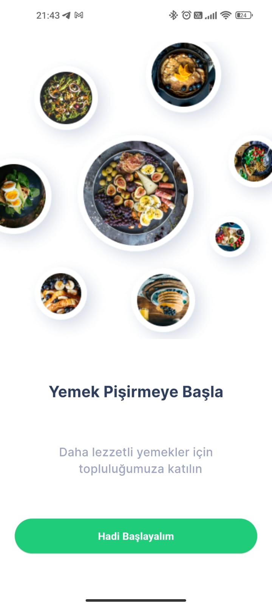

# 🍳 TarifDefteri - Flutter ile Yemek Tarif Uygulaması



Firebase tabanlı, GetX ile geliştirilmiş modern tarif uygulaması. Kullanıcılar tarif paylaşabilir, keşfedebilir ve favorilerine ekleyebilir.

## ✨ Öne Çıkan Özellikler

### 🔐 Güvenli Kimlik Doğrulama
- Telefon OTP ile giriş
- Firebase Authentication
- Profil yönetimi

### 🍽️ Tarif Yönetimi
- Yiyecek/içecek kategorilerine göre filtreleme
- Dinamik malzeme ve adım ekleme
- Tarif fotoğrafı yükleme

### ❤️ Kişiselleştirilmiş Deneyim
- Favori tarifler
- Kişisel tarif koleksiyonu
- Kullanıcı profil sayfası

## 📱 Ekran Görüntüleri

<div align="center">
  <table>
    <tr>
      <td></td>
      <td></td>
      <td></td>
    </tr>
    <tr>
      <td><i>Hoş Geldiniz</i></td>
      <td><i>OTP Doğrulama</i></td>
      <td><i>Kullanıcı Kaydı</i></td>
    </tr>
  </table>

  <table>
    <tr>
      <td></td>
      <td></td>
      <td></td>
    </tr>
    <tr>
      <td><i>Ana Sayfa</i></td>
      <td><i>Tarif Özeti</i></td>
      <td><i>Detaylı Tarif</i></td>
    </tr>
  </table>

  <table>
    <tr>
      <td></td>
      <td></td>
      <td></td>
    </tr>
    <tr>
      <td><i>Yeni Tarif</i></td>
      <td><i>Pişirme Adımları</i></td>
      <td><i>Kullanıcı Profili</i></td>
    </tr>
  </table>
</div>

## 🛠️ Teknoloji Yığını

| Bileşen          | Teknoloji                     |
|------------------|-------------------------------|
| Çatı             | Flutter 3.x                   |
| State Management | GetX                          |
| Backend          | Firebase (Auth, Firestore)    |
| Kimlik Doğrulama | Firebase Auth + OTP           |
| API              | RESTful                       |
| Depolama         | Firebase Storage              |

## 📦 Kurulum

1. Projeyi klonlayın:
```bash
git clone https://github.com/kullaniciAdiniz/tarif-defteri.git
